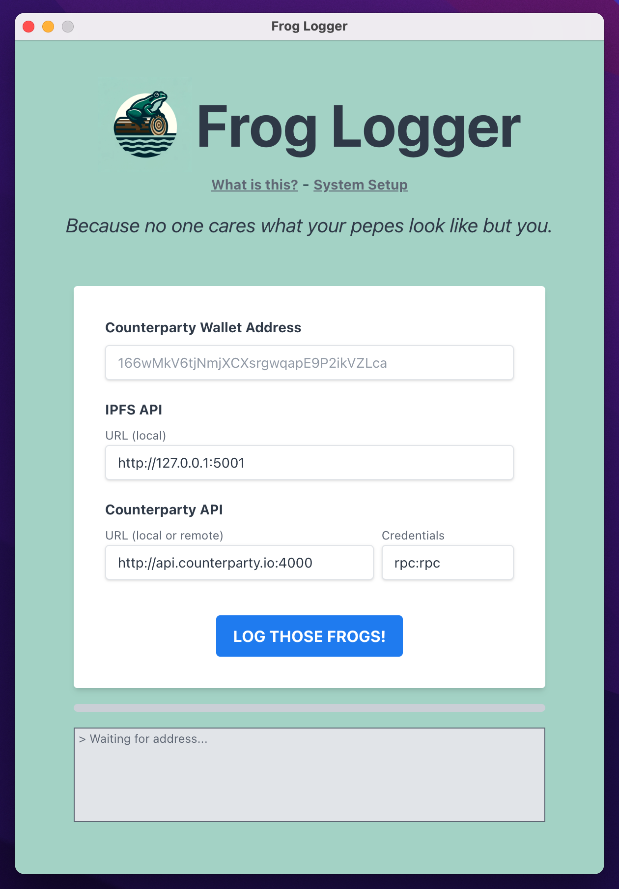
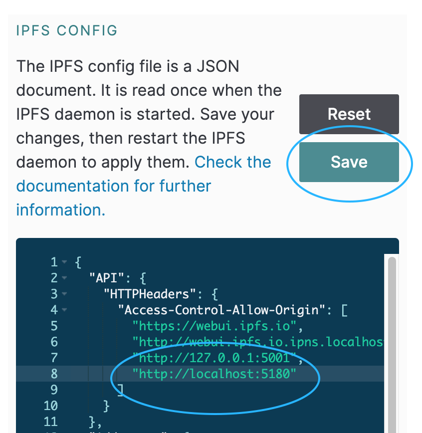

# Frog Logger

Frog Logger is a tool for pepe artists and collectors to backup their collection to their home computer as well as pin it to their own IPFS node for discovery by others. Pepes will only be saved by Frog Logger if they conform to the IPFS format in [CIP-25](https://github.com/CounterpartyXCP/cips/blob/master/cip-0025.md#ipfs-format) which includes pepes minted with [Rare Pepe Wallet](https://rarepepewallet.wtf/).

## Download
You can download the latest version in [Releases](https://github.com/loon3/frog-logger/releases/).

## System Setup

Before using Frog Logger, you need to do the following:

1. Download and install IPFS Desktop.
2. Open IPFS Desktop, click on Settings and scroll to IPFS CONFIG.
3. If the Access-Control-Allow-Origin object is missing from the IPFS config, restart IPFS Desktop.
4. Add http://localhost:5180 to your IPFS config file.
5. Restart IPFS Desktop.
6. Open Frog Logger.

After these steps, you can start using Frog Logger to backup and pin your pepe collection.

## Troubleshooting

If Frog Logger hangs up or is otherwise not working properly, first try restarting IPFS Desktop then restarting Frog Logger.